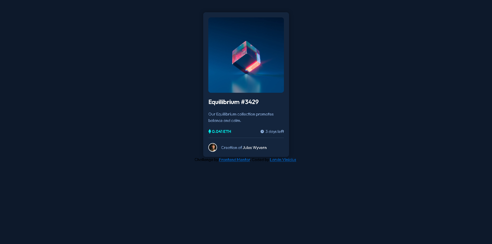

# Frontend Mentor - NFT preview card component solution

Esta é uma solução para o [NFT preview card component challenge on Frontend Mentor](https://www.frontendmentor.io/challenges/nft-preview-card-component-SbdUL_w0U). Os desafios do Frontend Mentor ajudam você a melhorar suas habilidades de codificação criando projetos realistas.

## Índice
  

-  [Visão Geral](#visão-geral)

	-  [O desafio](#o-desafio)

	-  [Screenshot](#screenshot)

	-  [Links](#links)

-  [Processo](#processo)

	-  [Construido com](#construido-com)

	-  [O que eu aprendi](#o=que-eu-aprendi)

-  [Autor](#autor)

## Visão Geral

###  O desafio

Os usuários devem ser capazes de:

- Visualizar o layout ideal dependendo do tamanho da tela do dispositivo
- Ver os estados de foco para elementos interativos

### Screenshot

   
### Links

- Solution URL: [Add solution URL here](https://github.com/Larvin-Vinicius/nft-preview-card-component-praticle)

- Live Site URL: [Add live site URL here](https://wg57u.csb.app/)

## Processo

### Construído com

- Semantic HTML5
- CSS basico
- Flexbox
- CSS Grid

### O que eu aprendi

- Utilizar a pseudo classe focus.
- A propriedade css cursor
- O atributo HTML tabindex

## Author

- Twitter - [@yourusername](https://twitter.com/Lrv_s)
